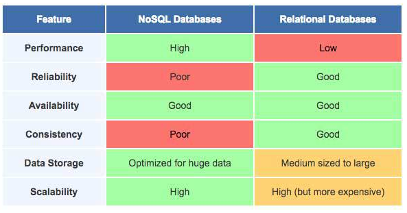

# WebChat

## Idea

When guests stay at hotels, they often need to communicate with hotel staff. Whether it's room service, restaurant recommendations, or noise complaints, they can use WebChat to readily talk with hotel staff and get their issues resolved. WebChat allows hotels to manage all of their customers issues in one place, allowing effective triaging across staff and ensurance that no customer need is left unresolved.

### Mission statement:

Provide hotels with a streamlined workflow for managing and handling guest requests, and provide guests with a frictionless service experience.

## User Journey

Luke is the hotel manager for a small-medium sized hotel in Warsaw. For years, guest queries have been dealt with at the reception desk or via the in-room telephones. Guests either have to make their way down to the hotel lobby or use the antiquated phone system. It's an inconvenience to guests. Many prefer not to make smaller requests, such as ordering bottles of water, over the phone, and in some cases don't make the requests at all as a result. This causes sub-par guest experiences and costs the hotel revenue in the process. Luke wants guests to feel like they have a direct line and an open conversation with hotel staff. In the Webchat interface, receptionists and other hotel staff can have a live chat conversations with guests to resolve their issues/requests.
Luke has another problem. His hotel has received several bad reviews related to customer service and he needs to track down the source of the hotels shortcomings. With WebChat, guests are asked to leave feedback after every request is resolved, giving him a detailed view of how well his staff are supporting guests. 

Gabe is a receptionist. He used to deal with customer queries either in-person or via a phone. Dealing with multiple queries at a time was difficult and oftentimes lead to long queues at reception and unanswered phone calls. It was hard to make sure every guest had been dealt with between the reception team and he was always worried he would make a mistake and risk his job. Thanks to WebChat, Gabe and his fellow receptionists have a feed of open and closed conversations and they can easily participate in live conversations with guests and close them when they are done. Customers love it and Gabe loves it.

## Solutions

### Features for MVP:

- Guests can scan a QR code that takes them to the chat application where they can talk with hotel staff.
- A guest can see a thread of the conversations that took place during their stay.
- App Owners and admins can add and remove receptionists.
- Receptionists can check in and check out a hotel Guest with a temporary login that will work during the course of their stay.
- Receptionists and Admins can log in to see pending conversations, chat to guests, and mark conversations as resolved.
- Guests can give a 5 star rating with an optional message at the end of each chat. 

### Features for future releases:

- Users (receptionists or guests) get feedback when the person they are talking to is typing
- Receptionists have the ability to create tasks, assign them to staff members, and mark them as completed.
- Admins can access a dashboard of metrics that indicate staff performance/shortcomings.
- Admins are notified when dangerous/harmful keywords or negative sentiment is taking place in a conversation (https://dialogflow.com/).
- An outline of a guests interactions with the hotel are sent via email or text (dependent on guest preferences) after their stay.
- Priority hotel rooms/guest conversations are highlighted in the app for Admins and receptionists.
- Conversations can be reassigned between Receptionists/Admins when they switch over shifts.
- Admins/receptionists can talk to guests in English and messages will be received in the guests preferred language (https://cloud.google.com/translate/docs/). 

- QR for log in

## Why build this?

### What problem does this application solve?

1. Hotels are looking for a streamlined and efficient workflow for managing and handling guest requests:
   - Receptionists previously had to talk to all guests over the phone or in-person meaning they could only talk to one guest at a time.
   - Receptionists had no means of tracking guest requests meaning some queries could have gone on unresolved.
2. Guests are looking for direct, frictionless, and convenient lines of conversation with minimal fuss:
   - Guests felt like walking down to reception or making a phone call from their room to initiate a small request was too much overhead.
   - Guests felt sometimes uncomfortable giving feedback face-to-face or over the phone.
   - Guests previously had to be inside the hotel to speak with staff or receptionists, or otherwise would need to have the hotels phone number, pay premium rates for mobile plans abroad, and possibly have to go through an operator before reaching a member of staff.

### How does your application solve the problem?

1. All guest conversations are in one place within a dashboard for receptionists and admins.
2. Receptionists have the ability to respond to multiple guests at a time.
3. Each guest query is linked to a guests stay/room, an indication of whether the request has been completed or not and a history of all the communication between that guest and the hotel.
4. Guests can request help with minimal overhead, using a mobile-friendly chat application.
5. Guests can access the app whether they're in their room or outside of the hotel. 
6. Guests can give feedback regarding each of their requests without the awkwardness of delivering feedback in person.

## Key Features

### What is the “bread and butter” of your app? What makes your app yours?

- The app is cloud based. There is no need for hotel guests to install any additional software.
- Seamless integration for hotels. Just sign up, create your users, generate unique key for your guest and you can start resolving any queries they might have.

## Competitive Landscape

### Who are your competitors and how do they solve this problem? List at least three. Link to screenshots or samples features.

**There are mature, general-purpose chat applications, these aren't tailored towards hotels, but have an extensive range of features:**

**Unite customer queries from all touch points (social, email, brand.coms)**  
Zendesk, Intercom, Kayako  
https://www.zendesk.com/support/

**Utilising conversation data for improved support**  
Zendesk - create company knowledge bases and FAQ pages based on conversation data - https://www.zendesk.com/guide/  
Drift - automate support conversations based on previous data  
LivePerson - creates ticket order based on sentiment analysis of text  
Dialog flow - pulls Google data to create smart chatbots that can be used in customer interactions

**App marketplaces with a suite of plugins and integrations to fit existing tech**  
Zendesk - get chats working across global languages. - https://www.zendesk.com/suite/  
Chatlio - integrates ticket support for teams that already use Slack.

**Cater to different industries and client sizes**  
Zendesk, Intercom - industry-specific features and pricing structures for different business sizes

**There are native applications specifically focussed at the hotel industry - require user download:**
RoomAssitant - live chat between guests and customers, as well as a host of other features that go beyond customer support and towards total hotel experience such as reservations and deals.
https://roomassistant.com/

Message Box - this application is either in development or has been left as a dormant project.
https://getmymessage.co/

**There are a smaller group of cloud-based chat applications specifically focussed on the hotel industry:**
Mi-Room - allow guests to book services, notify the hotel of nutritional requirements etc. with a prebuilt set of options.
https://www.mi-room.com/how-it-works/

### How many types of user accounts will you need for this project? For each user account type, answer the following:

**Account Type:** Super Admin 
**Description:** Owner of the application.  
**Needs:** Access to everything; create admin accounts, manage billing.

**Account Type:** Admin  
**Description:** Hotel manager or senior staff members.  
**Needs:** Complete overview of guest requests, metrics on service level/staff ratings, ability to create staff accounts.

**Account Type:** Receptionist  
**Description:** Hotel receptionist.  
**Needs:** Complete overview of guest requests, respond and engage with guests, mark requests as resolved, generate unique codes for new guests.

**Account Type:** Guest  
**Description:** End user.  
**Needs:** Access to the chat application during their stay, ability to view their conversation history for the stay.

## Monetization

### Which users would be willing to pay for your app?
Larger businesses with more throughput - 5 staff members (admins or receptionists) for free, extra cost per account per month.

### What features can you charge for in your app?
Task management and ability to have general staff member accounts for completing tasks.

### Is there a possibility of a subscription model? Or a one time purchase?
Monthly subscription for unlimited admins/receptionists with task management capabilities.

## Features

A new customer finds the Co for the first time and has a quick question to further his research.

### For each feature in your spec answer the following:

**Feature Name:**

**User access:** 
**2-3 User Stories:** As a **\_** I want to **\_\_\_** so that\***\*\_\*\***  
**What internal APIs will you build to implement this feature?**  
**Are there third party services, APIs, or platforms will you use to implement this feature?**  
**Have you considered using native frameworks?**  
**What are the costs and benefits of using the third party solution?**

- Guests can scan a QR code that takes them to the chat application where they can talk with hotel staff.

**Feature Name:**
Ability to generate unique guest login codes on check in and deactivate on check out

- **User access:**
  - Receptionist
  - admin
  - super admin  
    **2-3 User Stories:**
  - As a Guest, I want to not have to register for the app so that I can use it quickly
  - As a Receptionist, I want to quickly generate guest login codes so that I can quickly check in a guest
  - As a Receptionist, I want to be able to quickly edit the expiration date in case the guest decides to stay at our hotel for a longer period of time.
  - As a Receptionist, I want to be able to quickly terminate the access for the  guest to the chat app on his check-out.
    **What internal APIs will you build to implement this feature?**
    A check guest in end point that returns a random unique code on successful check in. 
    [POST] create new code
    [PUT] edit expiration date (either to prolong it or let it expire)
    **Are there third party services, APIs, or platforms will you use to implement this feature?**  
    **Have you considered using native frameworks?**  
    **What are the costs and benefits of using the third party solution?**

**Feature Name:**
Ability to login

- **User access:**  
  ALL  
   **2-3 User Stories:** As a **\_** I want to **\_\_\_** so that\***\*\_\*\***
  - As a Guest, I want to quickly login so that I can identify myself and use the features of the app.
  - As a Receptionist, I want to login so that I can identify and get access to receptionist secured features.
  - As an Admin, I want to login so that I can identify and get access to admin secure features.
  **What internal APIs will you build to implement this feature?**
  [POST] Login endpoint
  **Are there third party services, APIs, or platforms will you use to implement this feature?**
  - OAuth
  **Have you considered using native frameworks?**
  **What are the costs and benefits of using the third party solution?**

**Feature Name:**  
Live Chat

- **User access:**  
  ALL  
  **2-3 User Stories:** As a **\_** I want to **\_\_\_** so that\***\*\_\*\***
  - As a Guest, I want to live chat with receptionists so that I can get the help I need.
  - As a Guest, I want to be able to see my entire coversation history, which took place during my stay at the hotel.
  - As a Receptionist/Admin, I want to live chat so that I can quickly help guests with what they need.
  - As a Receptionist/Admin I wan to to be able to see the history of all conversations with each Guest for the duration of their stay at our hotel.
  **What internal APIs will you build to implement this feature?**
  - Connect to chat endpoint
  **Are there third party services, APIs, or platforms will you use to implement this feature?**
  - Socket.io
  **Have you considered using native frameworks?**  
  **What are the costs and benefits of using the third party solution?**

**Feature Name:**  
Ability to change the status of chats

- **User access:**
  - Receptionist
  - Admin
  - Super Admin  
    **2-3 User Stories:** As a **\_** I want to **\_\_\_** so that\***\*\_\*\***
  - As a receptionist I want to change the status of chats so that I keep track of which Guest qeueries are active and which have been resolved.
  **What internal APIs will you build to implement this feature?**
  [PUT] Chat status
  - Connect to chat endpoint
  **Are there third party services, APIs, or platforms will you use to implement this feature?**
  - Socket.io
  **Have you considered using native frameworks?**  
  **What are the costs and benefits of using the third party solution?**

**Feature Name:** Rate the service

  - **User access:** 
  Guest, Admin
  - **User Story:** 
  As a Guest, I want to be able to leave rating on how my request was fullfileld, so that I can give a task specific feedback.
  - **User Story:** 
  As an Admin, I want to be able to see how Hotel Guests are satisfied with my Hotel Staff, so that I can use it in their performance review.
  **What internal APIs will you build to implement this feature?**
  [POST] Feedback
  **Are there third party services, APIs, or platforms will you use to implement this feature?**  
  **Have you considered using native frameworks?**  
  **What are the costs and benefits of using the third party solution?**

**Feature Name:**
Ability to add/remove Receptionist user type.

  **User access:** 
  Admin, Super Admin
  **User Stories:** 
  As a Super Admin/Admin, I want to be able to create new Receptionist user so that he can serve hotel guests.
  **User Stories:**  
  As a Super Admin, I want to be able to remove Receptionist user so that I can change his role in the company.
  **What internal APIs will you build to implement this feature?**
  [POST] New user type
  [DELETE] User type  
  **Are there third party services, APIs, or platforms will you use to implement this feature?**
  **Have you considered using native frameworks?**
  **What are the costs and benefits of using the third party solution?**

**Feature Name:**
Ability to scan a QR code to access guest login screen

  **User access:**
  Guest
  **User Stories:**
  - As a Guest, I want to access the app without having to type in a URL.
  **What internal APIs will you build to implement this feature? [GET] guest login page**
  **Are there third party services, APIs, or platforms will you use to implement this feature? qrcode**
  **Have you considered using native frameworks?**
  **What are the costs and benefits of using the third party solution? Don't have the time to make a QR generator and reader.**

## Views

This is the url to the wireframe ('https://balsamiq.cloud/suh6vv2/pj65y7f')

**View Name:**  
Guest login  
**User access:**  
Guest  
**How will the user navigate to the view?**  
Via URL  
**What elements/animations will you use to create the view?**  
Input to collect guest's login code  
Button to login

**Are there third party services, APIs, or platforms will you use to implement this view?**

##### APIs

PUT Login

##### Third Party

OAuth  
**What are the costs and benefits of using the third party solution?**

**View Name:**  
Guest chat model  
**User access:**  
Guest  
**How will the user navigate to the view?**  
Via Guest Login view.  
This is also the homepage for logged in guests.  
**What elements/animations will you use to create the view?**  
Textbox for typing message  
Button for sending message  
Div for chat bubbles  
Img for picture of receptionist  
Headers for receptionist name and for receptionist motto

**Are there third party services, APIs, or platforms will you use to implement this view?**

##### APIs

Connect to chat

##### Third party services

Socket.io  
**What are the costs and benefits of using the third party solution?**

**View Name:**  
Employee login  
**User access:**  
All staff members  
**How will the user navigate to the view?**  
via URL  
**What elements/animations will you use to create the view?**  
Input for username  
Input for password  
Button to login  
**Are there third party services, APIs, or platforms will you use to implement this view?**

##### APIs

PUT Login

##### Third Party

OAuth

**What are the costs and benefits of using the third party solution?**

**View Name:**  
Support team view  
**User access:**  
receptionist , admin or super admin  
**How will the user navigate to the view?**  
Default view on login or from navbar when logged in  
**What elements/animations will you use to create the view?**

Tickets includes:

- Navbar for active, queued and closed tickets subviews
- Count of tickets
- active, queued and closed subview all have
- A list of cards  
   - Each card has the guest's room number and preview of the most recent message in the chat. When the card is clicked it becomes the current chat.  
   

Current chat includes:

- Textbox for typing message
- Button for ending chat
- Button for sending message
- Div for chat bubbles
- Headers for guest name and the room number

**Are there third party services, APIs, or platforms will you use to implement this view?**

##### APIs

Connect to chat  
Get queued tickets  
Get closed tickets  
Get active tickets  
Put queued ticket to change ticket state (active, queued or closed)

##### Third party services

Socket.io  
**What are the costs and benefits of using the third party solution?**

**View Name:**  
Chat log  
**User access:**  
Admin, receptionist and guest  
**How will the user navigate to the view?**  
Admin and receptionist will navigate by clicking on a card in the closed tab.  
guest via link

**What elements/animations will you use to create the view?**  
Img for picture of receptionist  
Headers for receptionist name, guest name, date and time of start and end of stay  
A list of the messages sent in this chat  
Each message has the name of the sender followed by the message. (stretch a date and time of groups of messages)  
If the user provided ratings during their stay show the average score of the chat.

 <!-- If the user did not provide ratings ask for the rating. (figure out if we want the guest to rate the entire stay)   -->

**Are there third party services, APIs, or platforms will you use to implement this view?**

##### APIs

Get ticket by id

<!-- Post ticket score -->

**What are the costs and benefits of using the third party solution?**

**View Name:**  
Employee Account settings  
**User access:**  
All employee accounts  
**How will the user navigate to the view?**  
Click on settings gear in header  
**What elements/animations will you use to create the view?**  
Input for old password required to update anything  
Input for new password  
Input prefilled with name  
Input prefilled with motto  
Img with current image  
Button to upload a new image  
Button to save all updated info

**Are there third party services, APIs, or platforms will you use to implement this view?**

##### APIs

Get current user info  
Put current user info  
**What are the costs and benefits of using the third party solution?**

**View Name:**  
Company dashboard  
**User access:**  
Admin and super admin  
**How will the user navigate to the view?**  
This will be the default view for the super admin  
Also via navbar  
**What elements/animations will you use to create the view?**

img for company picture  
h for company name  
h for company motto  
Button or buttons to update hotel name and motto

List of employees  
Each member has name, delete button and a dropdown with role. Only super admin can change the role to admin.

Button to add a new team member

**Are there third party services, APIs, or platforms will you use to implement this view?**

##### APIs

Get company members  
Put company member to change the role  
only super admins can change the role to admin  
Delete company members  
Get company info  
Put company info  
**What are the costs and benefits of using the third party solution?**

**View Name:**  
Add team member model  
**User access:**  
Admin and super admin  
**How will the user navigate to the view?**  
 By clicking the add new member button  
**What elements/animations will you use to create the view?**  
Input for email  
Button for submit  
**Are there third party services, APIs, or platforms will you use to implement this view?**  
**What are the costs and benefits of using the third party solution?**

**View Name:**  
Payment info view  
**User access:**  
Super admin  
**How will the user navigate to the view?**  
From clicking on navbar  
**What elements/animations will you use to create the view?**  
List of different membership plans  
Currently selected membership plan  
Button to update membership plan  
List of payment methods (paypal, credit card ect)  
Currently selected payment method  
Button to update payment method  
**Are there third party services, APIs, or platforms will you use to implement this view?**  
**What are the costs and benefits of using the third party solution?**

**View Name:**  
Check in check out  
**User access:**  
Receptionist and admin  
**How will the user navigate to the view?**  
From clicking on navbar  
**What elements/animations will you use to create the view?**  
dropdown to select room number  
date picker for checkout date  
Input for guest name (optional)  
check in button  
Input for email if guest wants a log  
check out button  
**Are there third party services, APIs, or platforms will you use to implement this view?**

##### APIs

POST check in a guest  
PUT or DELETE checkout a guest  
GET room numbers  
**What are the costs and benefits of using the third party solution?**

# Architectural Recommendations

## Front End

**What technology solution will you use for your front-end?**  
**What problems does this solution solve for this specific project?**  
**What are the drawbacks of using this solution over alternatives?**

React with Redux for global state management.

This solution will allow us to render UI components dynamically with state changes, whilst also making asynchronous calls to the backend. React will give us flexibility to build a highly modular and, therefore reusable and testable, set of components. In this particular project, the solution allows us to display all of our linked views across the ticket support display, user acount details, and customer chat modal, whilst (1) readily updating the recorded conversation, the status of tickets, and their assignees, and (2) handling user authentication requests and their associated views.

React gives us complete flexibility over which other libraries we may want to integrate within our application, when compared with framework solutions such as Angular and Vue. As a project that may in future look to deliver a native mobile solution that smaller customer service teams can use on the go (as in the case of webchat support competitors), React also offers the ability to re-use the bulk of our code base in a React Native setting. A potential drawback of using React over alternative options is that Vue is slightly more lightweight, requiring less memory and generally running faster when the same application is built on both technologies. Although it is possible to write React applications in Typescript, Angular's coupling with the Typescript language makes for a solution that most effectively covers type-checking and reduces room for such type errors that can occur in dynamically-typed Javascript. This downside can be somewhat limited by introducing prop-type checks across our React application.

## Design Framework

**What library or framework will you be using for styling and presentation?** (We highly recommend using a third-party component library - we will help pay for premium themes)  
**What problems does this solution solve for this specific project?**  
**What are the drawbacks of using this solution over alternatives?**

## Back End

**What technology solution will you use for your back-end?**

We will use Node.js and it's Express framework to build the server and APIs. For the chat app, we will use Socket.IO.

**What problems does this solution solve for this specific project?**

- [**Node.js**](https://nodejs.org/en/) is a JavaScript runtime build on Chrome's V8 engine. Being an interface to the V8 JavaScript runtime, it enables super fast JavaScript interpreter that runs in the Chrome browser. Its non-blocking I/O model is ideal for real-time applications, like chats, even tho it is single threaded. Event loop takes care of all the asynchronous I/O operations without blocking synchronous tasks. That means actions like reading or writing to the database, or network requests can be performed very quickly and not block the process.

- [**Express.js**](https://expressjs.com/) is a flexible Node.js framework that provides robust set of features for web and mobile applications. The pleathora of HTTP utility methods and middleware available allows us to quickly create robust API.

- [**Socket.IO**](https://socket.io/docs/) is a library, that enables real-time bidirectional communication between the server and the browser. This means that the server can push messages to clients. Whenever you write a chat message, the idea is that the server will get it and push it to all other connected clients. The benefits of using Socket.IO instead of vanilla WebSockets are:
  - It supports fallback options
  - It supports broadcasting
  - Connection can be established in presence of proxies and load balancers

**What are the drawbacks of using this solution over alternatives?**

- Everything runs on JavaScript

## Deployment

**What technology solution will you use to deploy your front-end and back-end?**

Front-end: Netlify
Back-end: Heroku

### Heroku
**What problems does this solution solve for this specific project?**
##### Heroku
  -	Quick and easy deployment - Ideal for agencies wishing to focus on product development and quickly delivering an application, but not wanting to deal with the overhead of managing systems 
  -	Has a low learning curve
  -	Excellent error logs. When a deployment fails in Heroku, it sends a standard error log, making debugging and deployment relatively painless.
  -	Scaling is fairly straightforward – a growing number of processing units (dynos) can be easily purchased based on needs and can be quickly assigned to instances through the CLI or Heroku’s web UI.
  - No lock-in when deciding to migrate to another service.
  - Has built-in tools and architecture
  - Offers great documentation
  - It is the cheapest option for a low traffic site.
  - Automatic deployment easily set up from GitHub
  
##### Netlify
  - Extremely easy to use
  - Ideal for front end deployments
  - Allows for easy deployment to production with automated deployments from GitHub

**What are the drawbacks of using this solution over alternatives?**
  -	Can quickly become expensive – A growing infrastructure may require may trigger a premium payment. Also, scaling an application is manual, meaning that it requires an increase in the amount of dynos that need to be purchased. – It can be as much as 3x-5x more expensive than a comparable setup through Iaas. The addons can also become very expensive.
  -	Limited configuration – Heroku makes it easy to quickly deploy an application but that comes at the expense of having any control over the exact configuration of an application. 
  -	On the free tier, applications are generally put to sleep after a period of inactivity in order to free system resources and will only get back up once the app received a web request. This can generally take up to 10-15 seconds.
  -	Although the initial setup is quick and easy, growing applications can be very slow to deploy after the first few deployments as the dynos require a longer time to restart.

## Database

What technology solution will you use for your database?

One of the main considerations for picking a database was to either choice a SQL or NOSQL database. Since our app involves real-time chat the number one consideration data wise for our app is read and write speed. Another key aspect that was decided on was scalability. Referring to the below table and thinking about the mentioned requirements for the database it was decided that a NOSQL technology would be selected.

 
Carla Andres table comparing relational to NOSQL databases

From reviewing a number of different NOSQL databases mongoDB was selected for these reasons :

- Ease of scaling via automatic scaling (Sharding)
- High performance
- Secure from SQL injection
- Supported by a large community (lots of resources)

What problems does this solution solve for this specific project?

- Quickly deliver messages to users. 
  Since mongoDB has a fast read and write speed it should allow for live messages to get delivered to the users quickly. This is partly because MongoDB does INSERT and UPDATE Asynchronous (eventual consistency).
- Allow for rapid scalability. 
  MongoDB offers auto sharding which allows for the database to grow horizontally over many servers rather then growing vertically. This is advantageous because horizontal growth is cheaper then vertical growth

What are the drawbacks of using this solution over alternatives?

- MongoDB is not as reliable as a traditional SQL DB. 
  MongoDB inserts and updates data asynchronously. This means that there is no return value for a successful insert or update. This allows for a faster insert or update but results in no confirmation that the operation was successful. Since speed is more important than reliability this is an acceptable trade off.
- No capabilities of a relational database.This means no joins. 
  Since a NOSQL DB is being used it will have to be designed in a way that makes sense for the technology. In some cases it could be seen as a positive that there are no joins.

## Model

**What data do you need?**

User information [username, name, email etc]
Employee data [employeeID, username, name email etc]
Admin data / can be a selected employee
Chat logs

**Where will you get the data?**

On our database which we have chosen at the top

**Will your data be stored locally on your front-ends (Mobile, FE Web)?**

If we store it locally we will have a lot of data to handle but if we use database of our choice then import it when needed i guess
**How is your data related?**

**What models do you need to represent your data fully in the database in a manner that is logical and consistent? For each model, show properties and initializers.**

# APIs - Internal and Third Party Services

## Feature List

**For each feature identified above, add the following information.**  
(Every feature should be listed and considered)

### Feature Name:

**What internal APIs will you build to implement this feature?**

**Are there third party services, APIs, or platforms will you use to implement this feature?**

**What are the costs and benefits of using the third party solution?**

# Outline and Weekly Plan

## Weekly Plan

**Look in Training Kit to find the weekly objectives. For each week create a plan for what will be implemented:**  
(Map out every week)

### Week X:

**What are the key goals you will accomplish?**

**What features or services will be completed?**

## Summary

Use the information above to fill out the following table:

| Name:                            | Web chat app                                          |
| :------------------------------- | :---------------------------------------------------- |
| **App description:**             | Web chat app is an application that solves ... by ... |
| **Front End:**                   | this                                                  |
| **Back End:**                    | that                                                  |
| **Database:**                    | that                                                  |
| **List of APIs:**                |
| - one                            |
| - two                            |
| **List of Additional Services:** |
| - one                            |
| - two                            |

# References

1. CARLA ANDRES (2017, April), NoSQL Databases: The Definitive Guide. Retrieved on April 23 2019, from https://blog.pandorafms.org/nosql-databases-the-definitive-guide/
